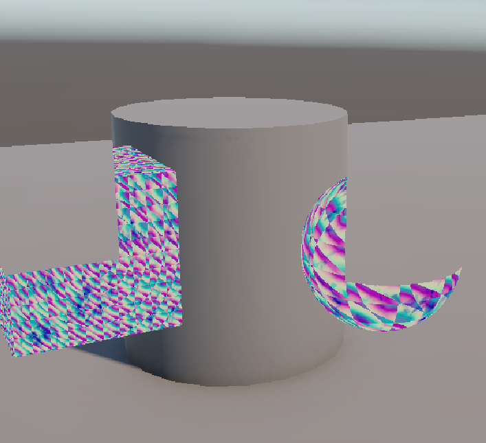

# はじめに
プログラムワークショップⅣの第2回の管理用です

# 結果画像

- 工夫した点：シェーダに模様の描画を追加し、さらに奥の物だけを描画する仕様にしました。

# 進め方

- 本リポジトリ(tpu-game-2025/PGWS4_2)をforkしてください。
- fork先のリポジトリを更新してください
- Unityのプロジェクトをsrc内で進めて下さい。
- 結果を画面キャプチャして、画像としてリポジトリに追加して、上記のリンクから見れるようにしてください。
- 完成したら本リポジトリのmainブランチにpull requestを投げてください

